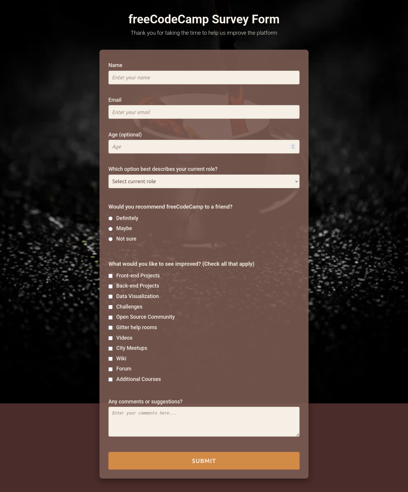

-----

# 📝 freeCodeCamp Survey Form

-----

## 🇧🇷 Português

### 🎯 Objetivo do Projeto

Este projeto é uma **página de formulário de pesquisa (Survey Form)**, desenvolvida como parte dos desafios do curso **"Responsive Web Design" do freeCodeCamp**. O objetivo foi praticar e demonstrar habilidades em HTML e CSS, focando na criação de formulários acessíveis e responsivos.

-----

### 🖼️ Visão Geral do Projeto



-----

### ✨ Funcionalidades

O formulário de pesquisa inclui as seguintes seções e campos:

  * **Título e Descrição:** Uma introdução clara sobre o propósito do formulário.
  * **Campos de Identificação:** Nome (obrigatório), Email (obrigatório, com validação de tipo) e Idade (opcional, com limites numéricos).
  * **Seleção de Papel Atual:** Um menu suspenso para que o usuário descreva sua função atual.
  * **Recomendação:** Perguntas de múltipla escolha (radio buttons) sobre a recomendação do freeCodeCamp.
  * **Melhorias Desejadas:** Campos de seleção múltipla (checkboxes) para indicar áreas de melhoria na plataforma.
  * **Comentários/Sugestões:** Uma área de texto para comentários abertos.
  * **Botão de Envio:** Para submeter o formulário.

-----

### 🚀 Tecnologias Utilizadas

  * **HTML5:** Estrutura semântica do formulário e da página.
  * **CSS3:** Estilização completa do formulário, incluindo layout responsivo, tipografia e cores.
      * **Flexbox:** Utilizado para organizar e alinhar elementos de forma flexível.
      * **Media Queries:** Para garantir que o formulário se adapte bem a dispositivos móveis e desktops.
      * **Google Fonts:** Para uma tipografia aprimorada.

-----

### 🎨 Design

O design foi concebido com uma paleta de cores terrosas e quentes, com um fundo visualmente interessante, para criar uma experiência de usuário acolhedora e focada. A responsividade é uma prioridade, garantindo que o formulário seja fácil de usar em qualquer dispositivo.

-----

### 🔗 Acesso ao Projeto

Você pode visualizar este projeto diretamente no GitHub Pages ou clonar o repositório para executá-lo localmente:

```bash
git clone https://github.com/GabrielMassensini/freecodecampsurvey-form.git
cd survey-form
```

Basta abrir o arquivo `index.html` em seu navegador web preferido.

-----

### 🌟 Status do Projeto

Concluído e passando em todos os testes do desafio do freeCodeCamp.

-----

## 🇬🇧 English

### 🎯 Project Objective

This project is a **Survey Form webpage**, developed as part of the **"Responsive Web Design" course challenges from freeCodeCamp**. The goal was to practice and demonstrate HTML and CSS skills, focusing on creating accessible and responsive forms.

-----

### 🖼️ Project Overview


-----

### ✨ Features

The survey form includes the following sections and fields:

  * **Title and Description:** A clear introduction about the form's purpose.
  * **Identification Fields:** Name (required), Email (required, with type validation), and Age (optional, with numeric limits).
  * **Current Role Selection:** A dropdown menu for the user to describe their current role.
  * **Recommendation:** Multiple-choice questions (radio buttons) about recommending freeCodeCamp.
  * **Desired Improvements:** Multiple-selection fields (checkboxes) to indicate areas for platform improvement.
  * **Comments/Suggestions:** A text area for open comments.
  * **Submit Button:** To submit the form.

-----

### 🚀 Technologies Used

  * **HTML5:** Semantic structure of the form and the page.
  * **CSS3:** Complete styling of the form, including responsive layout, typography, and colors.
      * **Flexbox:** Used to organize and align elements flexibly.
      * **Media Queries:** To ensure the form adapts well to mobile and desktop devices.
      * **Google Fonts:** For enhanced typography.

-----

### 🎨 Design

The design was conceived with an earthy and warm color palette, with a visually interesting background, to create a welcoming and focused user experience. Responsiveness is a priority, ensuring the form is easy to use on any device.

-----

### 🔗 Project Access

You can view this project directly on GitHub Pages or clone the repository to run it locally:

```bash
git clone https://github.com/GabrielMassensini/freecodecampsurvey-form.git
cd survey-form
```

Simply open the `index.html` file in your preferred web browser.

-----

### 🌟 Project Status

Completed and passed all freeCodeCamp challenge tests.

-----

## 👤 Author

## **Gabriel Alves Massensini**
